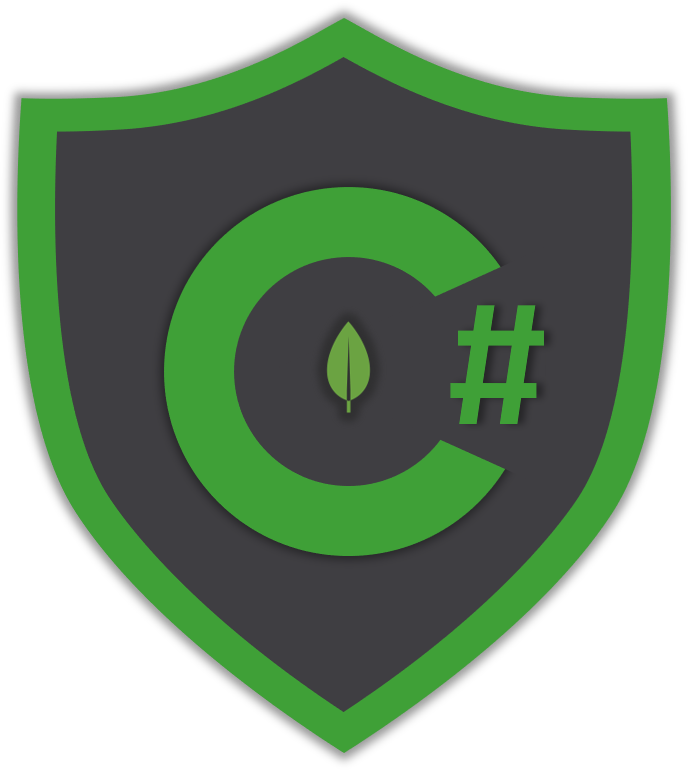

# Introduction

## ℹ About the docs

MongoDB has been evolved dramatically over the years 💪 resulting more developers of many different language and backgrounds, to be attracted to it. While there are official MongoDB [drivers](https://docs.mongodb.com/ecosystem/drivers/) for many different languages, many developers find kind of difficult to solve their problems based on each driver's reference or API. 

These MongoDB C\# driver docs have been created for one purpose and one purpose only - to **bridge the gap between MongoDB and C\# developers** 👏. You will find numerous samples solving problems all developers facing on a daily basis.




These docs don't intend to replace the official MongoDB documentation but instead act as a complementary reference, especially for C\# developers 


## ❓ How to read the docs

It depends on what your are looking for. In case this is the very first time your are dealing with MongoDB using the [C\# driver](https://docs.mongodb.com/ecosystem/drivers/csharp/) then you should definitely read the entire Getting Started section from top to bottom.

On the other hand, in case you already have some experience with the driver and you simply want to find a sample that may help you solve your problem, just search for it. 

### ✨ Samples

All pages contain some introductory theory to get the reader on the right context. For all samples the solutions are presented in 3 different ways:

* Using the C\# driver in typed manner
* Using the C\# driver with `BsonDocument` which is a schema-less way to build MongoDB queries
* Using the pure MongoDB shell commands

This way you can always compare the shell commands with the .NET code used.


The main goal of the docs is to learn you how to use the C\# driver in a **typed** way using your C\# class models and avoiding the generic `BsonDocument`. While you can easily build any MongoDB query you want with the schema-less way, it's way too ugly plus you will face problems when changing/renaming your model properties, thus it's not recommended.


The code for solving a specific case will look like this:



```csharp
var travelersQueryableCollection = tripsDatabase
    .GetCollection<Traveler>(travelersCollectionName).AsQueryable();

var sliceQuery = from t in travelersQueryableCollection
                select new 
                {
                       t.Name, 
                       visitedCountries = t.VisitedCountries.Take(1)
                };
            
var sliceQueryResults = await sliceQuery.ToListAsync();
```



```csharp
var bsonSlicePipeline = new[]
{
    new BsonDocument()
    {
        {"$project", new BsonDocument()
            {
                {   "name",  1 },
                {
                    "visitedCountries", new BsonDocument()
                    {
                        {"$slice", new BsonArray() { "$visitedCountries", 1 } }
                    }
                }
            }
        }
    }
};
```



```javascript
db.travelers
.aggregate()
 .project({ 
            name: 1, 
            visitedCountries : 
            { 
                       $slice: ["$visitedCountries", 1] 
            }})
 .pretty()
```



As you can see, the solution is presented in 3 different ways. If any other code snippet is required it will be added through a new tab.


The **C\#** tab will always contain the typed way of querying MongoDB


### Repository

All samples of the docs are part of the [mongodb-csharp](https://github.com/chsakell/mongodb-csharp) repository. Each sample is fully isolated and can be tested as long you have setup a local MongoDB server. Also, docs\` structure matches the solution's file and folder structure so that you can easily spot and run the sample you are interested in. What sample runs when you fire the console app, depends on what sample is activated in the _**appsettings.json**_ file.



```javascript
{
  "Samples": {
    "QuickStart_AccessDatabases": false,
    "QuickStart_AccessCollections": false,
    "QuickStart_InsertDocuments": false,
    "QuickStart_ReadDocuments": false,
    "QuickStart_UpdateDocuments": false,
    "QuickStart_DeleteDocuments": false,
    "Crud_Insert_OrderedInsert": false,
    "Crud_Insert_WriteConcern": false,
    "Crud_Read_Basics": false,
    "Crud_Read_Query_ComparisonOperators": false,
    "Crud_Read_Query_LogicalOperators": false,
    "Crud_Read_Query_ElementOperators": false,
    "Crud_Read_Query_EvaluationOperators": false,
    "Crud_Read_Query_ArrayOperators": false,
    "Crud_Update_BasicOperators": false,
    "Crud_Update_ReplaceDocuments": false,
    "Crud_Update_UpdatingArrays": false,
    "Aggregation_Stages_Match": false,
    "Aggregation_Stages_Group": false,
    "Aggregation_Stages_Projection": false,
    "Aggregation_Stages_Unwind": false,
    "Aggregation_Stages_Bucket": false,
    "Aggregation_Stages_Limit_Skip": false,
    "Expressions_Slice": true,
    "Expressions_Filter": false
  }
}
```



According to the above configuration when the app fires, the samples that will run are inside the _Slice.cs_ file in the _**Expressions**_ folder.


Avoid running multiple samples simultaneously. Each sample usually starts with dropping the database to be used and adding a banch of documents _\(sometimes 1000 documents\)_ to a collection.


## How to contribute

Contribution on the docs is of course highly welcomed as long as it fulfills the following criteria:

* **Request a new sample**: You can open a new issue at the repository's [issues](https://github.com/chsakell/mongodb-csharp/issues) page, as long as there isn't a related one already. Make sure you have done your search either in the docs or the source code before opening the issue. Last but not least, add some sample data to explain exactly what you are looking for.
* **Fix a sample's code**: Fork the repository, create and send a pull request.

