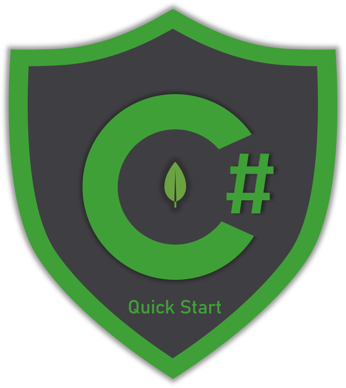

# 🏃‍♂️ Quick start

## Do you like shortcuts?

If the answer is yes then you are on the right page. Quick start section can help you get your hands dirty right on as it contains samples with the most common CRUD ➕➖📝 ❌ operations when dealing with any database. You will learn step by step how to:

1. Connect to a MongoDB instance
2. List all databases existing in the instance
3. List all collections existing in a specific database
4. Insert one or many documents at once in a collection
5. Search for and read documents from a collection
6. Update one or more documents in a collection


Quick start is recommended for those who have never used the `MongoDB .NET` driver




## Install Nuget packages

To start writing MongoDB queries using C\# , you need to install the **MongoDB.Driver** 🚘 Nuget package in your project with one of the following ways:

### dotnet CLI

```csharp
dotnet add package MongoDB.Driver
```

### Visual Studio

Open the _Nuget Package Manager_, search for and install the package.

### Nuget Package Manager

```csharp
Install-Package MongoDB.Driver
```

